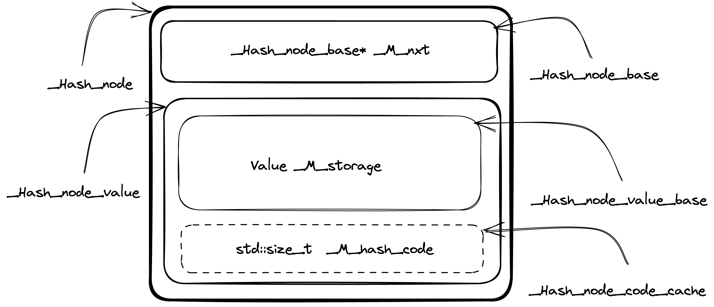
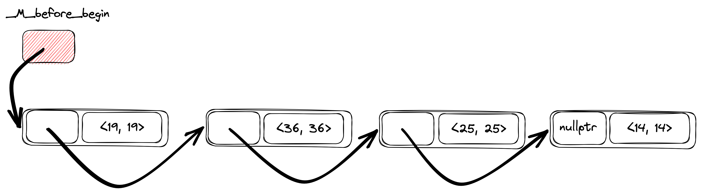
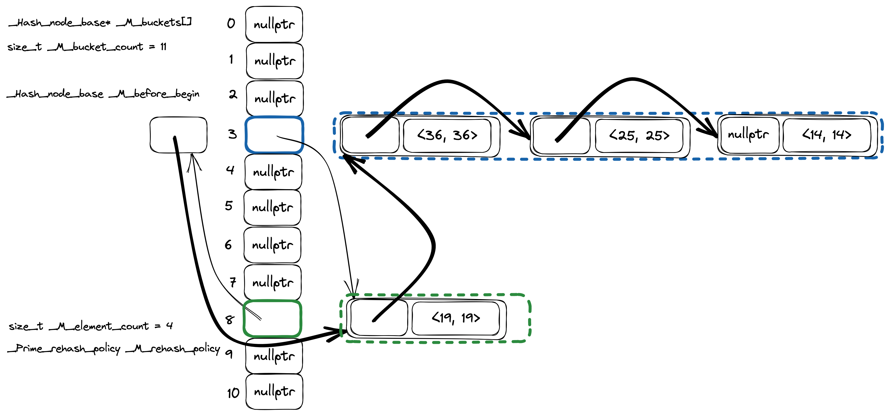

We all love maps. We love hash maps even more. They should be fast and
help to solve a large number of problems. Do you ever wonder about how they are
working under the hood? In this post I am going to explore implementation
details of unordered associative containers from C++ Standard Library
(precisely GCC's libstdc++ implementation, I'll use [b9b7981f3d][37] revision
for code examples).

Currently there are four types of unordered associative containers:

* `std::unordered_map`,
* `std::unordered_set`,
* `std::unordered_multimap`,
* `std::unordered_multiset`.

Usually, they are implemented on top of some kind of `Hashtable` container. I am
going to jump into implementation of this `Hashtable` container directly,
because that's where all the interesting stuff is hidden.

I'll  focus on the key/value containers with a unique set of keys
(`std::unordered_map`), `std::unordered_set` have mostly similar logic. Multi
keys containers are different beasts. They share a large portion of code with
unique keys containers, but insertion and find logic is quite different, due to
the set of stored keys is actually a [multi set][34] (allows multiple instances of
the same key).

GCC's libstdc++ implementation can be found in the [hashtable.h header][1], the
class of interest is named `_Hashtable`. There will be a lot of names with
leading underscores. Not everyone is used to such code, but Standard Library
implementers have no choice [to avoid collisions with user defined names][2]
(macros for example). 

## Policy-Based Design

`_Hashtable` class implemented by decomposition into [policies][35] and closely
recalls [GCC's Policy-Based Data Structures design][36]. Some of these policies
are available for redefinition by the user, for example `_Alloc`, `_Equal` and
`_Hash`. Some depend on the container type, like `_ExtractKey`, `_Value`. And
others like `_RangeHash` and `_RehashPolicy` can be defined by library implementers
only.

```cpp
template<typename _Key, typename _Value, typename _Alloc,
   typename _ExtractKey, typename _Equal,
   typename _Hash, typename _RangeHash, typename _Unused,
   typename _RehashPolicy, typename _Traits>
class _Hashtable
<...>
```

## Data Layout

If you don't want to dive into the details, you can use [this comment][3]
from the hashtable.h header to grasp the basics of `_Hashtable` data layout.

### Nodes

One of the basic building blocks of the `_Hashtable` is a node. Each node is
allocated from the heap and stores container data along with metadata
information to maintain hash table data structure. The actual content of the
node is data dependent (more about it later).

The node itself is a compound entity and contains several parts, some of them
are optional. The design of the node structs brings to mind
[matryoshka dolls][12], because they are nested to each other. More complex
node type (with more data) is inherited from the simpler node type (with a
little bit less data). Let's walk through the components bottom up (from
simpler to more complex).

`_Hash_node_base` [defined][4] in the following way. It has only `_M_nxt`
field, which is a pointer to the next node of the hash table. 

```cpp
struct _Hash_node_base
{ 
  _Hash_node_base* _M_nxt;

<...>
};
```

The next one ` _Hash_node_value_base` is a little bit more interesting
(see code [here][5]). `_Hash_node_value_base` has a `_Value` template
parameter which is actual data stored in the container.

```cpp
template<typename _Value>
  struct _Hash_node_value_base
  {
    typedef _Value value_type;

    __gnu_cxx::__aligned_buffer<_Value> _M_storage;

    <...>
  };
```

`_Value` type is wrapped into `__gnu_cxx::__aligned_buffer` (thin wrapper around
`std::aligned_storage`) to [decouple][6] memory allocation from actual object
creation.

The [next struct][7] is `_Hash_node_code_cache` and it implements hash value
caching logic.

```cpp
template<bool _Cache_hash_code>
  struct _Hash_node_code_cache
  { };

template<>
  struct _Hash_node_code_cache<true>
  { std::size_t  _M_hash_code; };
```

`_Hash_node_code_cache` uses template specialization mechanism to extend
struct with an additional `_M_hash_code` field. And this optimization, I
believe, is one of the reasons why the «matryoshka dolls»-like design for node structs
are used. This way [Empty Base Optimization (EBO)][8] can be leveraged, when
`_Hash_node_code_cache` will be extended by inheritance. And that's exactly
what `_Hash_node_value` [is doing][8]:

```cpp
template<typename _Value, bool _Cache_hash_code>
  struct _Hash_node_value
  : _Hash_node_value_base<_Value>
  , _Hash_node_code_cache<_Cache_hash_code>
  { };
```

Size of the `_Hash_node_value` will be the same as size of
`_Hash_node_value_base<_Value>` in case template argument `_Cache_hash_code` is
false as `_Hash_node_code_cache` will be an empty struct.

The final piece of the puzzle is the `_Hash_node` combining everything above
together:

```cpp
template<typename _Value, bool _Cache_hash_code>
  struct _Hash_node
  : _Hash_node_base
  , _Hash_node_value<_Value, _Cache_hash_code>
  {
    <...>
  };
```

Below is the picture ([original](libstdc++-hash-node-layout.png)) of `_Hash_node` struct
data layout to better visualize what's going on.



Summarizing, `_Hash_node` (directly or inherited from base structs) contains
the following data.

1. `_Hash_node_base* _M_nxt` is a pointer to the next element in the linked list
   of hash table elements.
2. `__gnu_cxx::__aligned_buffer<_Value> _M_storage` — node data itself. For
   example for `std::unordered_map<std::string, int>` container `_Value` template
   argument is `std::pair<const std::string, int>`.
3. `std::size_t _M_hash_code` optional cached value of key's hash.

### Hash table

`_Hashtable` class [defined][10] in the following way (I replaced type aliases
with actual types being used to simplify code reading):

* `__buckets_ptr` -> `_Hash_node_base**`,
* `size_type` -> `std::size_t`,
* `__node_base` -> `_Hash_node_base`,
* `__node_base_ptr` -> `_Hash_node_base*`.

```cpp
template<<...>>
  class _Hashtable
  <...>
  {
    private:
      _Hash_node_base**     _M_buckets          = &_M_single_bucket;
      std::size_t           _M_bucket_count     = 1;
      _Hash_node_base       _M_before_begin;
      std::size_t           _M_element_count    = 0;
      _RehashPolicy         _M_rehash_policy;
    
      <...>                   
       _Hash_node_base*     _M_single_bucket    = nullptr;
  };
```

The `_Hashtable` class itself is a combination of
`std::forward_list<_Hash_node>` containing the elements and
`std::vector<std::forward_list<_Hash_node>::iterator>` representing the buckets
([code comment][11]).

`_Hash_node_base** _M_buckets` is an array of pointers to hash table nodes. You
can think of it as `_Hash_node_base* _M_buckets[]` instead of pointer to a
pointer.

`_Hash_node_base _M_before_begin` is a special node without any user data.
This node stores a pointer to the first hash table element (if there is
any) in `_M_before_begin._M_nxt`.

An interesting thing is that `_M_buckets` contains `_Hash_node_base*`
instead of `_Hash_node*`. The reason is because `_M_buckets` is kind of a
storage for two types of objects: actual hash table nodes and a special
«before begin node» (`_M_before_begin`). Invariant is each bucket
stores a pointer to the node **before** the first node from the bucket.
Meaning, the bucket containing the first element of the table actually stores
the address of the `_M_before_begin` element. I hope it becomes clearer with
an example.

Suppose we have the following code. We create `std::unordered_map` and insert
four keys in this order: 14, 25, 36, 19.

```cpp
std::unordered_map<int, int> map;

map[14] = 14;
map[25] = 25;
map[36] = 36;
map[19] = 19;
```

Then the internal `_Hashtable` linked list will look like one on the picture
below ([original](libstdc++-hashtable-linked-list.png)). The key order in the
hash table is a reverse insertion order, so key's iteration order will be:
19, 36, 25, 14.




Let's make a real hash table from the linked list by adding
buckets ([original](libstdc++-hashtable-layout.png)).



There are 11 buckets in the picture (vertical stack of rectangles), only two
buckets are not empty: bucket #3 (keys 36, 25 and 14) and bucket #8 (key 19).
Thin arrows are pointers from the `_Hashtable` internal linked list from the
previous picture, this time slightly rearranged and grouped together by
buckets. Now you can probably understand better what I meant by the phrase
«each bucket stores a pointer to the node before the first node from the
bucket». Bucket #3 has keys 36, 25 and 14, but a `_Hash_node_base*` from
`_M_buckets` array point to the element with a key 19, which is a **previous**
element in the hash table iteration order. Same logic is true for the bucket #3.
For this bucket `_M_buckets` array has a pointer to the `_M_before_begin` node.

## «Fast» and «slow» hash functions

GCC's libstdc++ hash table implementation distinguish between fast and slow
hash functions. If hash function is slow, then hash code will be cached
inside the hash table node.

Currently `std::hash` is [fast by default][26] (including user defined types),
except for `long double` and string-like types (`std::string`,
`std::string_view` and all other variations of character types).

```cpp
template<typename _Hash>
struct __is_fast_hash : public std::true_type
{ };

template<>
struct __is_fast_hash<hash<long double>> : public std::false_type
{ };
```

I am not completely sure what is the reasoning behind marking `std::hash<long double>`
as slow (and the [commit message][15] didn't shed more light on the topic), but for
string-like types it totally makes sense.

Comparison of two strings with length `n` and `m` has a `O(min(n, m))` time
complexity, but if we'll cache hash value in the hash table node, we can
implement faster negative comparison: if hash codes of two strings do not
match, we can instantly  conclude they are not equal. Moreover, for a `rehash`
operation we can avoid hash recalculation for every key in the hash table as
well. All of that in exchange for 8 more bytes of memory to store a hash value
(`std::size_t`) for every node. Seems like a reasonable trade-off for me.


As a side note I want to mention that for integer types `std::hash`
is [defined][16] as an [identity function][17], which is indeed fast.

```cpp
#define _Cxx_hashtable_define_trivial_hash(_Tp) 	\
  template<>						\
    struct hash<_Tp> : public __hash_base<size_t, _Tp>  \
    {                                                   \
      size_t                                            \
      operator()(_Tp __val) const noexcept              \
      { return static_cast<size_t>(__val); }            \
    };
```


## Insert

Now, when we know how hash table data structure is organized internally, let's
look into the implementation of `insert`.

High level steps are the following.

1. Check there is no such key in the hash table.
2. Create a hash table node.
3. Insert a new node to a hash table data structure.

The implementation is in the `_M_insert_unique` [method][13]. And there is
a surprise from the very first line of the code.

```cpp
if (size() <= __small_size_threshold())
  for (auto __it = begin(); __it != end(); ++__it)
    if (this->_M_key_equals_tr(__k, *__it._M_cur))
      return { __it, false };
```

If the hash table is «small» we just iterate from the beginning to the end and
compare all the keys already in the hash table with a key we are trying to
insert. Thresholds for «fast» and «slow» hash functions are [different][18].

```cpp
template<typename _Hash>
struct _Hashtable_hash_traits
{ 
  static constexpr std::size_t
  __small_size_threshold() noexcept
  { return std::__is_fast_hash<_Hash>::value ? 0 : 20; }
};
```

Then, we generate a hash code from a search key and try to find if there is a
node in the hash table, but only for «big» hash tables, as we already did a
linear search for «small» ones.

```cpp
__hash_code __code = this->_M_hash_code_tr(__k);
size_type __bkt = _M_bucket_index(__code);

if (size() > __small_size_threshold())
  if (__node_ptr __node = _M_find_node_tr(__bkt, __k, __code))
    return { iterator(__node), false };
```

And finally, if there is no such key in the hash table, we create a new node
and insert it into the data structure.

```cpp
_Scoped_node __node {
  __node_builder_t::_S_build(std::forward<_Kt>(__k),
                 std::forward<_Arg>(__v),
                 __node_gen),
  this
};
auto __pos
  = _M_insert_unique_node(__bkt, __code, __node._M_node);
__node._M_node = nullptr;
return { __pos, true };
```

Actual insertion logic is hidden inside `_M_insert_unique_node` [method][19].
There we decide if the hash table requires a rehash and insert a node into
the beginning of the bucket.

```cpp
const __rehash_state& __saved_state = _M_rehash_policy._M_state();
std::pair<bool, std::size_t> __do_rehash
  = _M_rehash_policy._M_need_rehash(_M_bucket_count, _M_element_count,
                                    __n_elt);

if (__do_rehash.first)
  { 
    _M_rehash(__do_rehash.second, __saved_state);
    __bkt = _M_bucket_index(__code);
  }
  
this->_M_store_code(*__node, __code);
    
// Always insert at the beginning of the bucket.
_M_insert_bucket_begin(__bkt, __node);
++_M_element_count;
return iterator(__node);
```

There is a lot of interesting things inside `_M_rehash_policy._M_need_rehash`,
but I don't want to bore you with too many details, only mention the fact that
the number of buckets in the hash table is a [prime number][20].


## Find

`_Hashtable::find` has the same optimization for small hash tables as `insert`,
for «small» hash tables with «slow» hash function we will do a
[linear search first][21], otherwise do a usual [bucket search][22].

```cpp
__hash_code __code = this->_M_hash_code(__k);
std::size_t __bkt = _M_bucket_index(__code);
return const_iterator(_M_find_node(__bkt, __k, __code));
```

`_M_find_node` is [implemented][23] through the call to `_M_find_before_node`.

```cpp
__node_ptr
_M_find_node(size_type __bkt, const key_type& __key,
             __hash_code __c) const
{    
  __node_base_ptr __before_n = _M_find_before_node(__bkt, __key, __c);
  if (__before_n)
    return static_cast<__node_ptr>(__before_n->_M_nxt);
  return nullptr;
}
```

`_M_find_before_node` is a good building block to have if you'll think about
`erase` implementation as we need to remove an element from the singly linked
lists, so having a pointer to a previous node comes in handy.

`_M_find_before_node` does mostly what we expect it to do, but has a couple of
interesting things in the sleeve.

We [locate][24] a pointer to the element before the first bucket element.

```cpp
__node_base_ptr __prev_p = _M_buckets[__bkt];
if (!__prev_p)
  return nullptr;
```

And [iterate][25] through elements in the bucket.

```cpp
for (__node_ptr __p = static_cast<__node_ptr>(__prev_p->_M_nxt);;
     __p = __p->_M_next())
  { 
    if (this->_M_equals(__k, __code, *__p))
      return __prev_p;
  
    if (!__p->_M_nxt || _M_bucket_index(*__p->_M_next()) != __bkt)
      break;
    __prev_p = __p;
  }
```

There is no stop condition in the `for` loop statement itself, but only in the
loop body. We will stop when there is no next element in the hash table linked
list or we are done with a current bucket.

```cpp
if (!__p->_M_nxt || _M_bucket_index(*__p->_M_next()) != __bkt)
  break;
```

The only way for us to understand we have crossed the bucket's boundary is to
explicitly get the bucket number for the element. To do so, we need to either
locate the cached hash value from the node itself, or recalculate hash code
from the key by calling `std::hash`. Now you probably get a better
understanding of the rationale behind `__is_fast_hash` logic as we need to know
the hash value of each element in the bucket chain until we find the right
one. And if the `std::hash` calls are expensive and hash code wasn't cached in
the node, then `find` performance might severely degrade.

Well, back to `_M_find_before_node`, to compare the search key with a key in the
node we call `_M_equals`, [where][27] we compare hash values first and if they are
equal, then compare keys.

```cpp
bool
_M_equals(const _Key& __k, __hash_code __c,
const _Hash_node_value<_Value, __hash_cached::value>& __n) const
{ return _S_equals(__c, __n) && _M_key_equals(__k, __n); }
```

And at the same time, `_S_equals` have two overloads, one for nodes with cached
value and one for nodes without hash. When a node [has cached value][28], we
compare key hash with a hash in the node. If there is [no cached hash
value][29], we do nothing. Think about integer keys for example. We know
`std::hash<int>{}(x) == x`, so there is no point in comparing hashes first.

```cpp
static bool
_S_equals(__hash_code __c, const _Hash_node_code_cache<true>& __n)
{ return __c == __n._M_hash_code; }

static bool
_S_equals(__hash_code, const _Hash_node_code_cache<false>&)
{ return true; }
```

## Erase

Last operation we need to cover to get a complete understanding of basic hash
table operations is `erase`. As I mentioned above, from the internal
representation point of view, nodes are connected together as a singly linked
list, so erase operation is [similar][30] to element removal from linked list.

As a first step we need to make sure the key we want to erase from the container is
present, to simplify the code, we actually will find the node **before** the
node we are going to remove. There are again two possible paths for «small» and «big»
hash tables.

For «small» tables we just do a linear search in the linked list by calling
`_M_find_before_node`.

```cpp
if (size() <= __small_size_threshold())
  {
   __prev_n = _M_find_before_node(__k);
   if (!__prev_n)
     return 0;

   // We found a matching node, erase it.
   __n = static_cast<__node_ptr>(__prev_n->_M_nxt);
   __bkt = _M_bucket_index(*__n);
  }
```

And for bigger ones, we are trying to find the correct bucket for the key and then
do a search in the bucket.

```cpp
else
  { 
   __hash_code __code = this->_M_hash_code(__k);
   __bkt = _M_bucket_index(__code);

   // Look for the node before the first matching node.
   __prev_n = _M_find_before_node(__bkt, __k, __code);
   if (!__prev_n)
     return 0;

   // We found a matching node, erase it.
   __n = static_cast<__node_ptr>(__prev_n->_M_nxt);
  }
```

If we found something, the actual manipulations with the linked list pointers are
done in the [overload][31] of `_M_erase` method for three arguments: `__bkt`
(bucket), `__prev_n` (previous node in the hash table linked list) and `__n`
(node we want to erase), where we update `_M_nxt ` pointer for `__prev_n` and
`_M_buckets` value if necessary, then destroy the node itself.

```cpp
if (__prev_n == _M_buckets[__bkt])
  _M_remove_bucket_begin(__bkt, __n->_M_next(),
     __n->_M_nxt ? _M_bucket_index(*__n->_M_next()) : 0);
else if (__n->_M_nxt)
  {
   size_type __next_bkt = _M_bucket_index(*__n->_M_next());
   if (__next_bkt != __bkt)
     _M_buckets[__next_bkt] = __prev_n;
  }

__prev_n->_M_nxt = __n->_M_nxt;
iterator __result(__n->_M_next());
this->_M_deallocate_node(__n);
--_M_element_count;

return __result;
```

## Closing thoughts

There are a lot of cool tricks implemented to improve performance of
`std::unordered_map` libstdc++ implementation. These tricks help for sure,
but the main issue of `std::unordered_map` (not only libstdc++ implementation,
but all standard compatible ones) is cache unfriendliness.

Almost every operation on the container is practically a textbook example of
[pointer chasing][32], so for real world use cases performance would not be as great
as it can be in «ideal» implementation from the data locality point of view. The main
problem is standard compatible implementation requires reference and iterator stability
and this requirement forces hash tables to be implemented using [chaining][33]. I hope
we'll find a solution for this in the future and bring faster hash tables in the C++
standard library, but we are not here yet.

In any case, libstdc++ implementation of `std::unordered_map` is really
awesome. I really enjoyed reading the code and learnt a lot, I hope you are
too.

[1]: https://github.com/gcc-mirror/gcc/blob/b9b7981f3d6919518372daf4c7e8c40dfc58f49d/libstdc%2B%2B-v3/include/bits/hashtable.h#L177-L1153
[2]: https://stackoverflow.com/a/228797/1313516
[3]: https://github.com/gcc-mirror/gcc/blob/b9b7981f3d6919518372daf4c7e8c40dfc58f49d/libstdc%2B%2B-v3/include/bits/hashtable.h#L110-L168
[4]: https://github.com/gcc-mirror/gcc/blob/b9b7981f3d6919518372daf4c7e8c40dfc58f49d/libstdc%2B%2B-v3/include/bits/hashtable_policy.h#L301-L316
[5]: https://github.com/gcc-mirror/gcc/blob/b9b7981f3d6919518372daf4c7e8c40dfc58f49d/libstdc%2B%2B-v3/include/bits/hashtable_policy.h#L318-L345
[6]: https://stackoverflow.com/a/50271887/1313516
[7]: https://github.com/gcc-mirror/gcc/blob/b9b7981f3d6919518372daf4c7e8c40dfc58f49d/libstdc%2B%2B-v3/include/bits/hashtable_policy.h#L347-L359
[8]: https://en.cppreference.com/w/cpp/language/ebo
[9]: https://github.com/gcc-mirror/gcc/blob/b9b7981f3d6919518372daf4c7e8c40dfc58f49d/libstdc%2B%2B-v3/include/bits/hashtable_policy.h#L361-L365
[10]: https://github.com/gcc-mirror/gcc/blob/b9b7981f3d6919518372daf4c7e8c40dfc58f49d/libstdc%2B%2B-v3/include/bits/hashtable.h#L386-L399
[11]: https://github.com/gcc-mirror/gcc/blob/b9b7981f3d6919518372daf4c7e8c40dfc58f49d/libstdc%2B%2B-v3/include/bits/hashtable.h#L123-L126
[12]: https://en.wikipedia.org/wiki/Matryoshka_doll
[13]: https://github.com/gcc-mirror/gcc/blob/b9b7981f3d6919518372daf4c7e8c40dfc58f49d/libstdc%2B%2B-v3/include/bits/hashtable.h#L2231-L2266
[14]: https://github.com/gcc-mirror/gcc/blob/b9b7981f3d6919518372daf4c7e8c40dfc58f49d/libstdc%2B%2B-v3/include/bits/functional_hash.h#L283-L300
[15]: https://github.com/gcc-mirror/gcc/commit/4df047dd3494ad17122ea46134a951a319a81b27
[16]: https://github.com/gcc-mirror/gcc/blob/b9b7981f3d6919518372daf4c7e8c40dfc58f49d/libstdc%2B%2B-v3/include/bits/functional_hash.h#L114-L199
[17]: https://en.wikipedia.org/wiki/Identity_function
[18]: https://github.com/gcc-mirror/gcc/blob/b9b7981f3d6919518372daf4c7e8c40dfc58f49d/libstdc%2B%2B-v3/include/bits/hashtable_policy.h#L293-L299
[19]: https://github.com/gcc-mirror/gcc/blob/b9b7981f3d6919518372daf4c7e8c40dfc58f49d/libstdc%2B%2B-v3/include/bits/hashtable.h#L2146-L2174
[20]: https://github.com/gcc-mirror/gcc/blob/b9b7981f3d6919518372daf4c7e8c40dfc58f49d/libstdc%2B%2B-v3/src/c%2B%2B11/hashtable_c%2B%2B0x.cc#L45C1-L88
[21]: https://github.com/gcc-mirror/gcc/blob/b9b7981f3d6919518372daf4c7e8c40dfc58f49d/libstdc%2B%2B-v3/include/bits/hashtable.h#L1677-L1683
[22]: https://github.com/gcc-mirror/gcc/blob/b9b7981f3d6919518372daf4c7e8c40dfc58f49d/libstdc%2B%2B-v3/include/bits/hashtable.h#L1685-L1687
[23]: https://github.com/gcc-mirror/gcc/blob/b9b7981f3d6919518372daf4c7e8c40dfc58f49d/libstdc%2B%2B-v3/include/bits/hashtable.h#L811-L819
[24]: https://github.com/gcc-mirror/gcc/blob/b9b7981f3d6919518372daf4c7e8c40dfc58f49d/libstdc%2B%2B-v3/include/bits/hashtable.h#L1939-L1941
[25]: https://github.com/gcc-mirror/gcc/blob/b9b7981f3d6919518372daf4c7e8c40dfc58f49d/libstdc%2B%2B-v3/include/bits/hashtable.h#L1943-L1952
[26]: https://github.com/gcc-mirror/gcc/blob/b9b7981f3d6919518372daf4c7e8c40dfc58f49d/libstdc%2B%2B-v3/include/bits/functional_hash.h#L294-L300
[27]: https://github.com/gcc-mirror/gcc/blob/b9b7981f3d6919518372daf4c7e8c40dfc58f49d/libstdc%2B%2B-v3/include/bits/hashtable_policy.h#L1740-L1743
[28]: https://github.com/gcc-mirror/gcc/blob/b9b7981f3d6919518372daf4c7e8c40dfc58f49d/libstdc%2B%2B-v3/include/bits/hashtable_policy.h#L1700-L1702
[29]: https://github.com/gcc-mirror/gcc/blob/b9b7981f3d6919518372daf4c7e8c40dfc58f49d/libstdc%2B%2B-v3/include/bits/hashtable_policy.h#L1691-L1693
[30]: https://github.com/gcc-mirror/gcc/blob/b9b7981f3d6919518372daf4c7e8c40dfc58f49d/libstdc%2B%2B-v3/include/bits/hashtable.h#L2344-L2383
[31]: https://github.com/gcc-mirror/gcc/blob/b9b7981f3d6919518372daf4c7e8c40dfc58f49d/libstdc%2B%2B-v3/include/bits/hashtable.h#L2316-L2342
[32]: https://en.wikichip.org/wiki/pointer_chasing
[33]: https://en.wikipedia.org/wiki/Hash_table#Separate_chaining
[34]: https://en.wikipedia.org/wiki/Multiset
[35]: https://en.wikipedia.org/wiki/Modern_C%2B%2B_Design#Policy-based_design
[36]: https://gcc.gnu.org/onlinedocs/libstdc++/ext/pb_ds
[37]: https://github.com/gcc-mirror/gcc/tree/b9b7981f3d6919518372daf4c7e8c40dfc58f49d/libstdc++-v3
