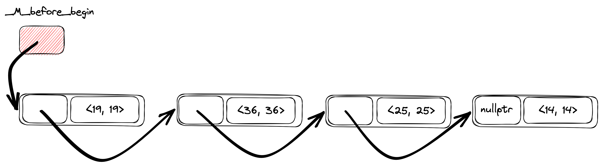
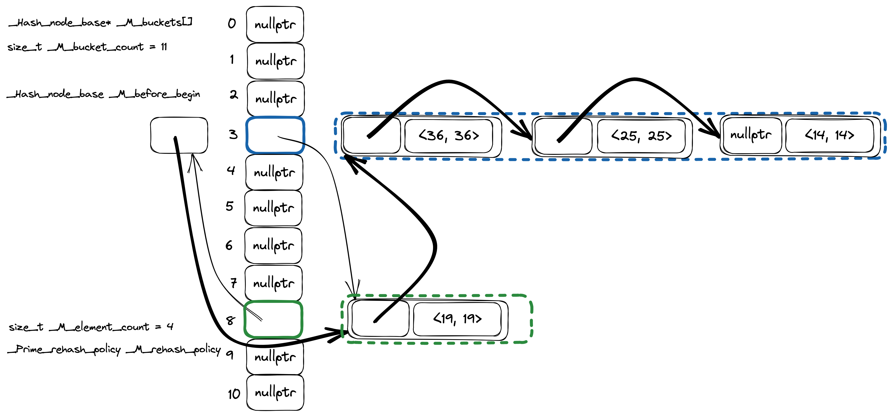

We all love maps. We love hash maps even more. They are fast (aren't they) and
help to solve a large number of problems. Do you ever wonder about how they are
working under the hood? In this essay I am going to explore implementation
details of unordered associative containers from C++ Standard Library.

Currently there are four types of unordered associative containers:

* `std::unordered_map`,
* `std::unordered_set`,
* `std::unordered_multimap`,
* `std::unordered_multiset`.

Usually, they implemented on top of some kind of `Hashtable` container. I am
going to jump into implementation of this `Hashtable` container directly,
because that's where all the interesting stuff is hidden.


## GCC's libstdc++ implementation

GCC's libstdc++ implementation can be found in the [hashtable.h header][1], the
class of interest is named `_Hashtable`. There are will be a lot of names with
leading underscores. Not everyone is used to such code, but Standard Library
implementers has no choice [to avoid collisions with user defined names][2]
(macros for example). 

### Data Layout

If you don't want to dive into the details to deep, you can use [this
comment][3] from hashtable.h header to grasp the basics of data layout.

#### Nodes

One of the basic building blocks of the `_Hashtable` is node. Each node is
allocated from the heap and stores containers data along with metadata
information to maintain hash table data structure. The actual content of the
node is data dependent (more about it later).

The node itself is a compound entity and contains several parts, some of them
are optional. The design of the nodes structs bring to mind a matryoshka dolls,
because they are nested to each other. More complex node type (with more data)
is inherited from the simpler node type (with a little bit less data). Let's
walk through the components bottom up (from simpler to more complex).

`_Hash_node_base` [defined][4] in the following way. It has only `_M_nxt`
field, which is a pointer to the next node of the hash table. 

```
struct _Hash_node_base
{ 
  _Hash_node_base* _M_nxt;

<...>
};
```

The next one ` _Hash_node_value_base` is a little bit more interesting
(see code [here][5]). `_Hash_node_value_base` has a `_Value` template
parameter which is a actual data stored in the container.

```
template<typename _Value>
  struct _Hash_node_value_base
  {
    typedef _Value value_type;

    __gnu_cxx::__aligned_buffer<_Value> _M_storage;

    <...>
  };
```

The actual `_Value` type is wrapped into `__gnu_cxx::__aligned_buffer` (thin
wrapper around `std::aligned_storage`) [to decouple memory allocation from
actual object creation][6].

The [next struct][7] is `_Hash_node_code_cache` and it implements hash value
caching logic.

```
template<bool _Cache_hash_code>
  struct _Hash_node_code_cache
  { };

template<>
  struct _Hash_node_code_cache<true>
  { std::size_t  _M_hash_code; };
```

`_Hash_node_code_cache` uses template specialization mechanism to extend
struct with an additional `_M_hash_code` field. And this optimization, I
believe, one of the reasons why the "matryoshka dolls"-like design for node structs
are used. This way [Empty Base Optimization (EBO)][8] can be leveraged, when
`_Hash_node_code_cache` will be extended by inheritance. And that's exactly
what `_Hash_node_value` [is doing][8]:

```
template<typename _Value, bool _Cache_hash_code>
  struct _Hash_node_value
  : _Hash_node_value_base<_Value>
  , _Hash_node_code_cache<_Cache_hash_code>
  { };
```

Size of the `_Hash_node_value` will be the same as size of
`_Hash_node_value_base<_Value>` in case template argument `_Cache_hash_code` is
true.

The final piece of the puzzle is the `_Hash_node` combining everything above
together:

```
template<typename _Value, bool _Cache_hash_code>
  struct _Hash_node
  : _Hash_node_base
  , _Hash_node_value<_Value, _Cache_hash_code>
  {
    <...>
  };
```

Below is the picture of `_Hash_node` struct data layout to better visualize
what's going on.


Summarizing, `_Hash_node` (directly or inherited from base structs) contains
the following data.

1. `_Hash_node_base* _M_nxt` is a pointer to the next element in the linked list
   of hash table elements.
2. `__gnu_cxx::__aligned_buffer<_Value> _M_storage` — node data itself. For
   example for `std::unordered_map<std::string, int>` container `_Value` template
   argument is `std::pair<const std::string, int>`.
3. `std::size_t _M_hash_code` optional cached value of key's hash.

#### Hash table

`_Hashtable` class [defined][10] in the following way (I replaced type aliases
with actual types being used to simplify code reading):

* `__buckets_ptr` -> `_Hash_node_base**`,
* `size_type` -> `std::size_t`,
* `__node_base` -> `_Hash_node_base`,
* `__node_base_ptr` -> `_Hash_node_base*`.

```
template<<...>>
  class _Hashtable
  <...>
  {
    private:
      _Hash_node_base**     _M_buckets          = &_M_single_bucket;
      std::size_t           _M_bucket_count     = 1;
      _Hash_node_base       _M_before_begin;
      std::size_t           _M_element_count    = 0;
      _RehashPolicy         _M_rehash_policy;
    
      <...>                   
       _Hash_node_base*     _M_single_bucket    = nullptr;
  };
```

The `_Hashtable` class itself is a combination of
`std::forward_list<_Hash_node>` containing the elements and
`std::vector<std::forward_list<_Hash_node>::iterator>` representing the buckets
([code comment][11]).

`_Hash_node_base** _M_buckets` is an array of pointers to hash table nodes. You
can think of it as `_Hash_node_base* _M_buckets[]` instead of pointer to a
pointer.

`_Hash_node_base _M_before_begin` is a special sentinel node without any user
data. This node stores pointer to the first hash table element (if there is
any) in `_M_before_begin._M_nxt`.

An interesting thing is that `_M_buckets` contains `_Hash_node_base*`
instead of `_Hash_node*`. The reason is because `_M_buckets` is kind of a
storage for two types of objects: actual hash table nodes and a special
sentinel «before begin node» (`_M_before_begin`). Invariant is each bucket
stores pointer to the node **before** first node from the bucket. Meaning,
bucket containing first element of table is actually stores address of the
sentinel element (`&_M_before_begin`). I hope it became clearer with an
example.

Suppose we have a following code. We create `std::unordered_map` and insert
four keys in this order: 14, 25, 36, 19.

```
std::unordered_map<int, int> map;

map[14] = 14;
map[25] = 25;
map[36] = 36;
map[19] = 19;
```

Then the internal `_Hashtable` linked list will look like one on the picture
below ([original](libstdcpp-hashtable-linked-list.png)). Keys order in the hash
table is a reverse insertion order, so keys iteration order will be:
19, 36, 25, 14.




Let's make a real hash table from the linked list and add
buckets ([original](libstdcpp-hashtable-layout.png)).



There are 11 buckets in the picture (stack of horizontal rectangles), only two
buckets are not empty: bucket #3 (keys 36, 25 and 14) and bucket #8 (key 19).
Thin arrows are pointers from the `_Hashtable` internal linked list from the
previous picture, this time slightly rearranged and grouped together by
buckets. Now you can probably understand better what I meant by phrase «each
bucket stores pointer to the node before first node from the bucket».
Bucket #3 has keys 36, 25 and 14, but a `_Hash_node_base*` from `_M_buckets`
array point to the element with a key 19, which a **previous** element in the
hash table iteration order. Same logic is true for the bucket #3. For this
bucket `_M_buckets` array has a pointer to the `_M_before_begin` sentinel node.


[1]: https://github.com/gcc-mirror/gcc/blob/b9b7981f3d6919518372daf4c7e8c40dfc58f49d/libstdc%2B%2B-v3/include/bits/hashtable.h#L177-L1153
[2]: https://stackoverflow.com/a/228797/1313516
[3]: https://github.com/gcc-mirror/gcc/blob/b9b7981f3d6919518372daf4c7e8c40dfc58f49d/libstdc%2B%2B-v3/include/bits/hashtable.h#L110-L168
[4]: https://github.com/gcc-mirror/gcc/blob/b9b7981f3d6919518372daf4c7e8c40dfc58f49d/libstdc%2B%2B-v3/include/bits/hashtable_policy.h#L301-L316
[5]: https://github.com/gcc-mirror/gcc/blob/b9b7981f3d6919518372daf4c7e8c40dfc58f49d/libstdc%2B%2B-v3/include/bits/hashtable_policy.h#L318-L345
[6]: https://stackoverflow.com/a/50271887/1313516
[7]: https://github.com/gcc-mirror/gcc/blob/b9b7981f3d6919518372daf4c7e8c40dfc58f49d/libstdc%2B%2B-v3/include/bits/hashtable_policy.h#L347-L359
[8]: https://en.cppreference.com/w/cpp/language/ebo
[9]: https://github.com/gcc-mirror/gcc/blob/b9b7981f3d6919518372daf4c7e8c40dfc58f49d/libstdc%2B%2B-v3/include/bits/hashtable_policy.h#L361-L365
[10]: https://github.com/gcc-mirror/gcc/blob/b9b7981f3d6919518372daf4c7e8c40dfc58f49d/libstdc%2B%2B-v3/include/bits/hashtable.h#L386-L399
[11]: https://github.com/gcc-mirror/gcc/blob/b9b7981f3d6919518372daf4c7e8c40dfc58f49d/libstdc%2B%2B-v3/include/bits/hashtable.h#L123-L126
