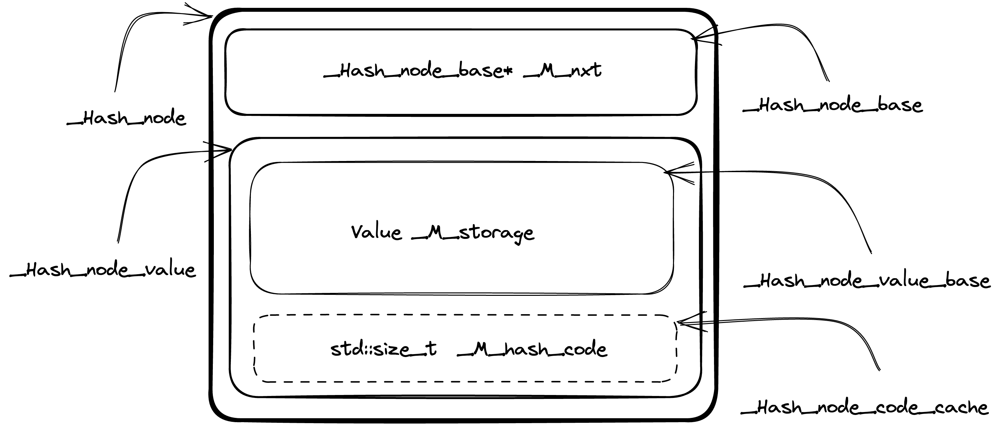

We all love maps. We love hash maps even more. They are fast (aren't they) and
help to solve a large number of problems. Do you ever wonder about how they are
working under the hood? In this essay I am going to explore implementation
details of unordered associative containers from C++ Standard Library.

Currently there are four types of unordered associative containers:

* `std::unordered_map`,
* `std::unordered_set`,
* `std::unordered_multimap`,
* `std::unordered_multiset`.

Usually, they implemented on top of some kind of `Hashtable` container. I am
going to jump into implementation of this `Hashtable` container directly,
because that's where all the interesting stuff is hidden.


## GCC's libstdc++ implementation

GCC's libstdc++ implementation can be found in the [hashtable.h header][1], the
class of interest is named `_Hashtable`. There are will be a lot of names with
leading underscores. Not everyone is used to such code, but Standard Library
implementers has no choice [to avoid collisions with user defined names][2]
(macros for example). 

### Data Layout

If you don't want to dive into the details to deep, you can use [this
comment][3] from hashtable.h header to grasp the basics of data layout.

#### Nodes

One of the basic building blocks of the `_Hashtable` is node. Each node is
allocated from the heap and stores containers data along with metadata
information to maintain hash table data structure. The actual content of the
node is data dependent (more about it later).

The node itself is a compound entity and contains several parts, some of them
are optional. The design of the nodes structs bring to mind a matryoshka dolls,
because they are nested to each other. More complex node type (with more data)
is inherited from the simpler node type (with a little bit less data). Let's
walk through the components bottom up (from simpler to more complex).

`_Hash_node_base` [defined][4] in the following way. It has only `_M_nxt`
field, which is a pointer to the next node of the hash table. 

```
struct _Hash_node_base
{ 
  _Hash_node_base* _M_nxt;

<...>
};
```

The next one ` _Hash_node_value_base` is a little bit more interesting
(see code [here][5]). `_Hash_node_value_base` has a `_Value` template
parameter which is a actual data stored in the container.

```
template<typename _Value>
  struct _Hash_node_value_base
  {
    typedef _Value value_type;

    __gnu_cxx::__aligned_buffer<_Value> _M_storage;

    <...>
  };
```

The actual `_Value` type is wrapped into `__gnu_cxx::__aligned_buffer` (thin
wrapper around `std::aligned_storage`) [to decouple memory allocation from
actual object creation][6].

The [next struct][7] is `_Hash_node_code_cache` and it implements hash value cache
logic.

```
template<bool _Cache_hash_code>
  struct _Hash_node_code_cache
  { };

template<>
  struct _Hash_node_code_cache<true>
  { std::size_t  _M_hash_code; };
```

`_Hash_node_code_cache` leverages template specialization mechanism to extend
struct by additional `_M_hash_code` field. And this optimization, I believe,
one of the reasons why the "matryoshka dolls"-like design for node structs are
used. This way [Empty Base Optimization (EBO)][8] can be leveraged, when
`_Hash_node_code_cache` will be extended by inheritance. And that's exactly
what `_Hash_node_value` [is doing][8]:

```
template<typename _Value, bool _Cache_hash_code>
  struct _Hash_node_value
  : _Hash_node_value_base<_Value>
  , _Hash_node_code_cache<_Cache_hash_code>
  { };
```

Size of the `_Hash_node_value` will be the same as size of
`_Hash_node_value_base<_Value>` in case template argument `_Cache_hash_code` is
true.

The final piece of the puzzle is the `_Hash_node` combining everything above
together:

```
template<typename _Value, bool _Cache_hash_code>
  struct _Hash_node
  : _Hash_node_base
  , _Hash_node_value<_Value, _Cache_hash_code>
  {
    <...>
  };
```

Below is the picture of `_Hash_node` struct data layout to better visualize
what's going on.




[1]: https://github.com/gcc-mirror/gcc/blob/7a0cbaf7f802df209840d78740ffc749dadd1ce3/libstdc%2B%2B-v3/include/bits/hashtable.h#L177-L1153
[2]: https://stackoverflow.com/a/228797/1313516
[3]: https://github.com/gcc-mirror/gcc/blob/b9b7981f3d6919518372daf4c7e8c40dfc58f49d/libstdc%2B%2B-v3/include/bits/hashtable.h#L110-L168
[4]: https://github.com/gcc-mirror/gcc/blob/b9b7981f3d6919518372daf4c7e8c40dfc58f49d/libstdc%2B%2B-v3/include/bits/hashtable_policy.h#L301-L316
[5]: https://github.com/gcc-mirror/gcc/blob/b9b7981f3d6919518372daf4c7e8c40dfc58f49d/libstdc%2B%2B-v3/include/bits/hashtable_policy.h#L318-L345
[6]: https://stackoverflow.com/a/50271887/1313516
[7]: https://github.com/gcc-mirror/gcc/blob/b9b7981f3d6919518372daf4c7e8c40dfc58f49d/libstdc%2B%2B-v3/include/bits/hashtable_policy.h#L347-L359
[8]: https://en.cppreference.com/w/cpp/language/ebo
[9]: https://github.com/gcc-mirror/gcc/blob/b9b7981f3d6919518372daf4c7e8c40dfc58f49d/libstdc%2B%2B-v3/include/bits/hashtable_policy.h#L361-L365
